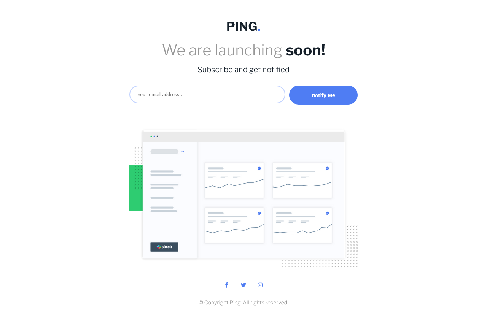

# Frontend Mentor - Ping coming soon page solution

This is a solution to the [Ping coming soon page challenge on Frontend Mentor](https://www.frontendmentor.io/challenges/ping-single-column-coming-soon-page-5cadd051fec04111f7b848da). Frontend Mentor challenges help you improve your coding skills by building realistic projects. 

## Table of contents

- [Overview](#overview)
  - [The challenge](#the-challenge)
  - [Screenshot](#screenshot)
  - [Links](#links)
- [My process](#my-process)
  - [Built with](#built-with)
- [Author](#author)
- [Acknowledgments](#acknowledgments)

## Overview

### The challenge

Users should be able to:

- View the optimal layout for the site depending on their device's screen size
- See hover states for all interactive elements on the page
- Submit their email address using an `input` field
- Receive an error message when the `form` is submitted if:
	- The `input` field is empty. The message for this error should say *"Whoops! It looks like you forgot to add your email"*
	- The email address is not formatted correctly (i.e. a correct email address should have this structure: `name@host.tld`). The message for this error should say *"Please provide a valid email address"*

### Screenshot

### Links

- Solution URL: [Github Repo](https://github.com/fritzadelbertus/FEM_Ping-Coming-Soon-Page)
- Live Site URL: [Github Pages](https://fritzadelbertus.github.io/FEM_Ping-Coming-Soon-Page/)

## My process

### Built with

- Semantic HTML5 markup
- CSS Flexbox
- Mobile-first workflow
- [React](https://reactjs.org/) - JS library
- [SASS](https://sass-lang.com/)
- [Vite](https://vitejs.dev/)

## Author

- Website - [Fritz Adelbertus](https://furitsu.site)
- Frontend Mentor - [@fritzadelbertus](https://www.frontendmentor.io/profile/fritzadelbertus)

## Acknowledgments

Thank to Front-End Mentor for providing this challenge. 3 more newbie project to go!